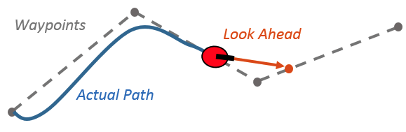

<!-- Add an appropriate emoji infornt of the project name, project name must be Heading 1 (#) -->
# 🐾️ Pure Pursuit

<!-- A very short blurb about the project -->
> Project Pure Pursuit will be our base for our control algorithm for the street drone. it would be accompanied by a state machine that uses Object Tracking and Waypoints to handle edge cases.

> This package was designed to be compatible with MCAV's velocity_planner package which is capable of generating local waypoints. 

<!-- badges, must include contributors. Tests, and others can be added if you want. -->
[](#contributors)

<!-- A screenshot or Gif of the working project -->


Pure Pursuit is a tracking algorithm which works by calculating the amount of curvature required to move a vehicle from its current position to some goal position. It tracks a reference path (made of waypoints) using the geometry of the vehicle kinematics as well as a fixed distance known as the look ahead distance. Ultimately, the vehicle chases a look ahead point which constantly changes as the vehicle moves. This look ahead point changes based on the current position of the vehicle until the last waypoint on the path and has a minimum distance of the look ahead relative to the vehicle. 

<!-- All requirements of the project should be links to where we can install them -->
<!-- pip dependencies must be added into a requirements.txt file -->
## Requirements
- [Ubuntu 20.04](https://ubuntu.com/download/desktop)
- [ROS2 Foxy](https://docs.ros.org/en/foxy/Installation/Ubuntu-Install-Debians.html)
- [CARLA 0.9.13](https://carla.readthedocs.io/en/latest/start_quickstart/#carla-installation) 
- [CARLA ROS Bridge](https://carla.readthedocs.io/projects/ros-bridge/en/latest/ros_installation_ros2/)
- [MCAV interfaces](https://github.com/Monash-Connected-Autonomous-Vehicle/mcav_interfaces) should be in the same workspace
- (Optional) [Velocity planner](https://github.com/Monash-Connected-Autonomous-Vehicle/velocity_planner) should be in the same workspace

### Other Requirements
...

<!-- Very simple installation procedure. If you can't install within 5 single line bullet points, you need to refactor your code to be  \
able to do so -->
## Installation
- Go to the `src` directory: e.g. `cd ~/colcon_ws/src`
- Clone the source code: `git clone <link-to-repo>`
- Go to the root of the workspace: `cd ~/colcon_ws`
- Install ROS dependencies: `rosdep install --from-paths src --ignore-src -r -y`
- Build: `colcon build --symlink-install`

#### Note
Add to .bashrc
'export CARLA_ROOT=<path-to-carla>'
'export PYTHONPATH=$PYTHONPATH:$CARLA_ROOT/PythonAPI/carla/dist/carla-<carla_version_and_arch>.egg:$CARLA_ROOT/PythonAPI/carla'

<!-- Directory structure gives a brief on what folders contain what. -->
This should result in a directory structure similar to the following:
```
ws/                                                     
├── 
src
└── pure_pursuit
    ├── launch                # launch files
    ├── misc                  # miscellaneous files
    ├── pure_pursuit          # project scripts
    ├── resource              # ROS build system files
    └── test                  # ROS build system files
```

## Usage
<!-- 
 Usage instructions must be concise. Any export statements must be added to .bashrc (add steps in either requirements of installation).

It should follow the structure mentioned below:
Terminal # (What are we doing):
- `shell code`
-->

### Launch CARLA and CARLA ROS bridge packages
Terminal 1 (Launch CARLA server):
- `/opt/carla-simulator/CarlaUE4.sh`

Terminal 2 (Launch CARLA ROS bridge):
> ROS bridge can be prone to crashing. Check that this terminal if the simulation stops working.
- `cd ~/carla-ros-bridge && source install/setup.bash`
- `ros2 launch carla_ros_bridge carla_ros_bridge.launch.py`

Terminal 3 (Launch twist to control package)
> Interprets ROS twist commands
- `cd ~/carla-ros-bridge && source install/setup.bash`
- `ros2 launch carla_twist_to_control carla_twist_to_control.launch.py`

### Launch simulation
Terminal 4 (Launch simulation)
- `cd ~/colcon_ws && source install/setup.bash`
- 'ros2 launch pure_pursuit purepursuit_simulation_standalone.launch.py'
    
Existing waypoints in a csv file can be specified as follows:
    ```ros2 launch pure_pursuit purepursuit_simulation_standalone.launch.py waypoint_filename:=/home/mcav/Sheng/control_ws/town01_path1.csv```
    
## Contributors ✨

Dummies ([emoji key](https://allcontributors.org/docs/en/emoji-key)):

<!-- ALL-CONTRIBUTORS-LIST:START - Do not remove or modify this section -->
<!-- prettier-ignore -->
<table>
  <tr>
    <td align="center"><a href="https://github.com/sqiu0004"><br /><sub><b>Sheng Qiu</b></sub></a><br /><a href="https://github.com/Monash-Connected-Autonomous-Vehicle/pure_pursuit/commits?author=sqiu0004" title="Code">💻</a></td>
  </tr>
  <tr>
    <td align="center"><a href="https://github.com/lakshjaisinghani"><br /><sub><b>Laksh Jaisinghani</b></sub></a><br /><a href="https://github.com/Monash-Connected-Autonomous-Vehicle/pure_pursuit/commits?author=lakshjaisinghani" title="Code">💻</a></td>
  </tr>
  <tr>
    <td align="center"><a href="https://github.com/owenbrooks"><br /><sub><b>Owen Brooks</b></sub></a><br /><a href="https://github.com/Monash-Connected-Autonomous-Vehicle/pure_pursuit/commits?author=owenbrooks" title="Code">💻</a></td>
  </tr>
</table>

<!-- ALL-CONTRIBUTORS-LIST:END -->

This project follows the [all-contributors](https://github.com/all-contributors/all-contributors) specification. Contributions of any kind welcome!


